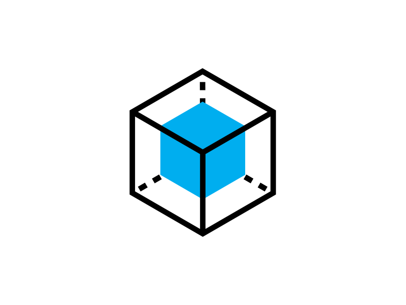
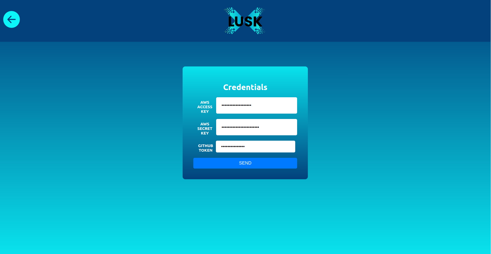
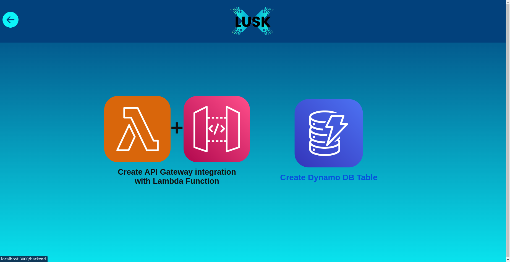
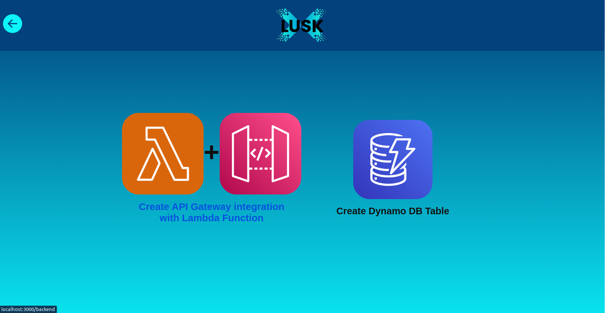
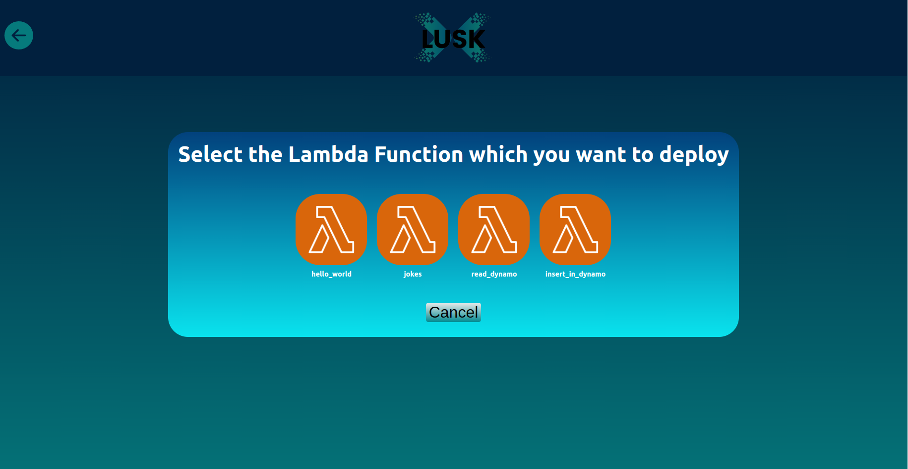
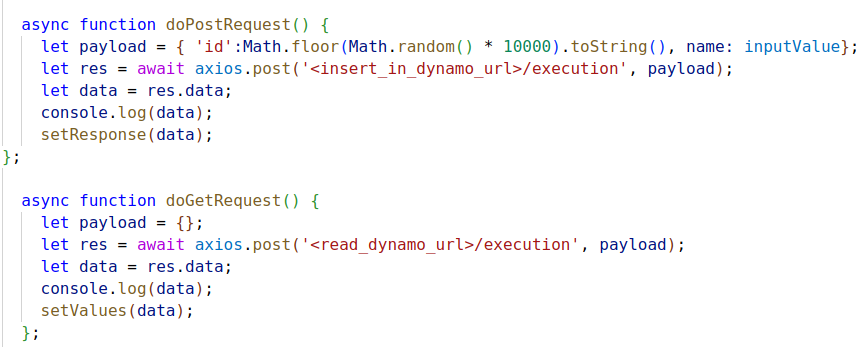
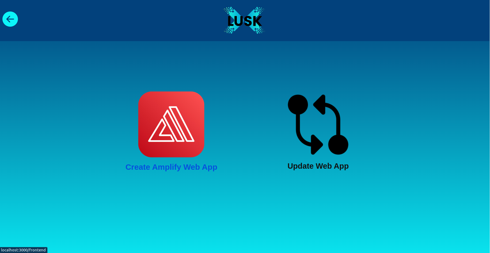
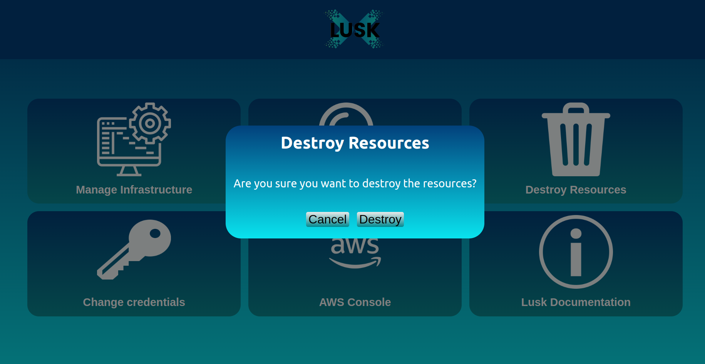
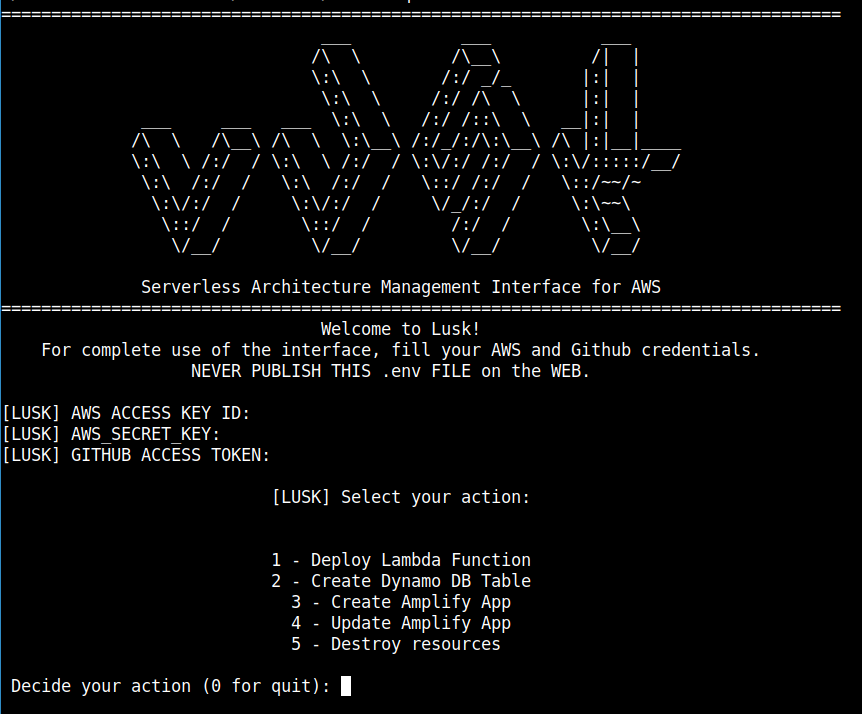

<div align="center" >


## Serverless Architecture Management Interface for AWS

</div>


<div align="center" style="max-width:28rem;">

## [Full Documentation and RoadMap available here](https://matheus-1618.github.io/Lusk-docs/)

</div>

Lusk is an early-stage open source tool to assist developers in their first steps into cloud computing.


With Lusk, you don't have to manage the underlying configuration of servers, subnets and DataBases.


 You just need to:

  * Create your own web application (there is a React template in **webapp/** folder);

  * Create your processing functions (AWS Lambdas functions) or use ready-made functions in the **lambda_functions** folder, which can integrate with *DataBases*, *process requests* and *more*, all behind managed API Endpoints. 

   Easy isn't?

 <div align="center" >

 

 </div >


## Build your own Lusk

* Do want to create your own Serverless Architecture Management Plataform? 

* Understand more about Cloud and IaC concepts with a hands-on tutorial? 

* Integrate another services or applications in the Lusk?

 <div align="center" >

 

 </div >

**If you want to discover the underlying steps to build this infrastructure using Terraform or it's a curious person, follow the [Roadmap](https://matheus-1618.github.io/Lusk-docs/roadmap/), and create your own Plataform, learning and customizing as you wish .**


## Enjoy a managed Full Stack Serverless archictecture 

**With Lusk deploy a Full stack app become simplier.**

<div align="center" style="max-width:38rem;">
  

 </div>

:warning: **It is desirable to have your Github credentials in the machine/system which you are executing the application. If you don't have, configure it following this [tutorial](https://www.freecodecamp.org/portuguese/news/como-resolver-o-problema-de-o-git-pedir-sempre-as-credenciais-do-usuario/)**.


### Using Graphical Interface

1. Clone the repository:
```bash
git clone https://github.com/matheus-1618/Lusk
```

2. Install dependencies (if you already have some installed, it'll be jumped):
```bash
./install.sh
```

3. Run the graphical interface:
```bash
./run.sh
```

4. Log with your [AWS credentials](https://docs.aws.amazon.com/powershell/latest/userguide/pstools-appendix-sign-up.html) and [Github token](https://docs.github.com/en/authentication/keeping-your-account-and-data-secure/creating-a-personal-access-token) (used internal only in a **.env** file):
<div align="center" >

 </div>

#### Creating your first application in 5 clicks 

1. Create an Dynamo DB NoSQL Database:
 <div align="center" >
 
 </div>

2. Create two Lambda Functions behind an API Gateway endpoint's to interact with Dynamo:
  <div align="center" >
  
 </div>

 Deploy **insert_in_dynamo** first, and **read_dynamo** after (you can test it):
 <br>
  <div align="center" >
 
 </div>

3. Integrate the API's endpoints in the **webapp/App.js** file to feedback the Frontend interface:
 <div align="center" >
 
 </div>

4. Create an Web Application hosted on Amplify Hosting with updates with CI/CD in your Github account:
 <div align="center" >

 </div>

5. Clean, if you wish, your infrastructure with one click:
 <div align="center" >

 </div>


### Using CLI Interface

If you prefer use a Command Line interface, follow the steps above:

1. Clone the repository:
```bash
git clone https://github.com/matheus-1618/Lusk
```

2. Install dependencies (if you already have some installed, it'll be jumped):
```bash
./install.sh
```

3. Run the Command Line interface:
```bash
./cli.sh
```
4. Fill out the credentials to create an **.env** file:
 <div align="center" >

 </div>

5. Enjoy the Application!
 <div align="center" >

 </div>


